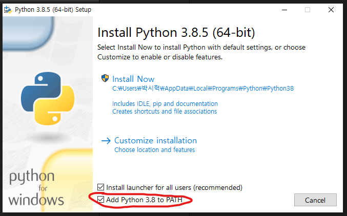

# 파이썬이란?
파이썬은 매우 쉽고 간편한 프로그래밍 언어입니다.  

## 설치
1. [파이썬 설치 링크](https://www.python.org/ftp/python/3.8.5/python-3.8.5-amd64.exe)에 들어갑니다.
2. 다운 받은 exe 파일을 실행합니다.
3. Add Python 3.8 to PATH 을 체크합니다.

4. Install Now를 클릭하세요.
5. 설치를 진행합니다.