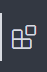

# 파이썬이란?
파이썬은 매우 쉽고 간편한 프로그래밍 언어입니다. <br>
얼마나 쉽고 간편하냐고요? <br>
프로그래밍 언어 중 매우 오래전 만들어졌지만 지금까지도 매우 많이 쓰이고 있는 언어, C언어에서 헬로 월드를 출력하는 것과 파이썬에서 출력하는 것을 비교하자면<br>
<b>파이썬</b>
```python
print("헬로 월드")
```
<b>C언어</b>
```c
#include <stdio.h>
int main(void){
    printf("헬로 월드");
    return 0;
}
```
완전 다르네요.


## 파이썬 설치
1. [파이썬 설치 링크](https://www.python.org/ftp/python/3.8.5/python-3.8.5-amd64.exe)에 들어갑니다.
2. 다운 받은 exe 파일을 실행합니다.
3. Add Python 3.8 to PATH 을 체크합니다.

4. Install Now를 클릭하세요.
5. 설치를 진행합니다.

## Visaul Studio Code 설치
파이썬으로 프로그래밍을 하기 위해 편리한 IDE(코드 편집 툴)을 설치해봅시다. <br>
1. [설치 링크](https://code.visualstudio.com/docs/?dv=win64user)에 들어가면 파일이 다운로드 됩니다. 
2. 다운로드 받은 exe 파일을 실행합니다.
3. 계속 다음을 누릅니다.
와! 그러면 vsc(Visaul Studio Code)가 설치되었네요!
이제 파이썬을 프로그래밍할 확장 기능을 설치해봅시다.
4. Ctrl + Shift + X 또는 왼쪽 상단에 이러한 모양을 클릭해줍니다. <br>
 
5. Python 을 검색합니다. <br>
6. Python 이라고 써져있는 곳에 install 버튼을 클릭합니다.
자! 이제 파이썬 개발 환경을 모두 설치하였습니다!