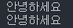

# 입력하기
이번 시간에는 사용자에게 입력을 받아볼겁니다. <br>
지난 시간에 출력하는 함수(이해 안하셔도 됩니다)가 <b>print</b> 였죠? <br>
입력을 받아오는 함수는 <b>input</b> 함수 입니다. <br>

## 코드
```python
a = input() #a란 변수에 사용자가 입력한 것을 넣음
```
어? print함수와는 조금 다르죠? <br>
print 함수는 
```python 
print("안녕")
```
이렇게 썼는데 input함수에서는 a라는 어떤 값이 추가되었습니다. <br>
```python
a = input() #a란 변수에 사용자가 입력한 것을 넣음
```
이 코드를 해석해 본다면<br>
a라는 변수(변하는 값)에 input함수(사용자가 입력한 값)을 넣는다는 얘기입니다!<br>
<br>
어? 근데 입력받아온 값을 어떻게 쓰냐고요?<br>
a라는 값을 저장했으니 a를 가져다 쓰면 되겠군요! <br>
```python
a = input() #a란 변수에 사용자가 입력한 것을 넣음
print(a) #a(입력받은 값)을 출력합니다.
```
이 코드를 한번 실행해볼까요? <br>
 <br>
입력한 값이 잘 프린트되네요!