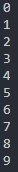

# 반복문
어떤 코드를 계속 반복하고 싶을 때 쓰입니다!<br>
여러가지 반복문 종류가 있으니 꼼꼼히 봐주세요!<br>

## for문
for문은 보통 이런 형식입니다.
```python
for 변수이름 in range(처음 값, 반복할 값):
    (코드)
```
해석을 해보자면, <br>
변수이름을 처음값부터 반복할 횟수-1까지 정하고 코드를 실행합니다. <br>
그러면
```python
for i in range(0, 10):
    print(i)
```
라고 한다면 0부터 9까지 총 10번을 반복할 것입니다. <br>
 <br>
이렇게 말이죠
